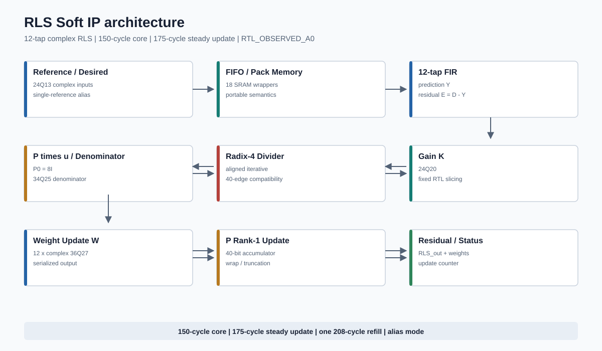
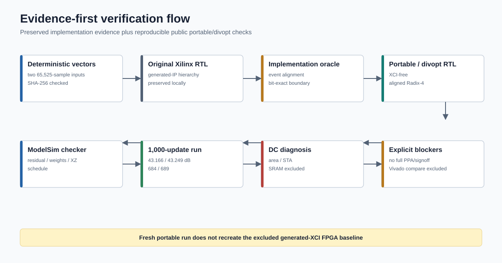
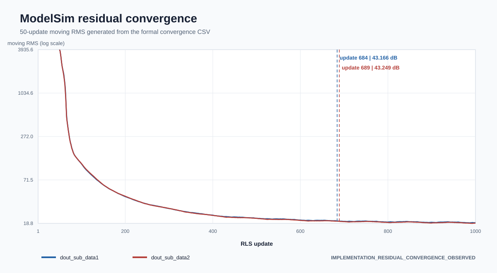
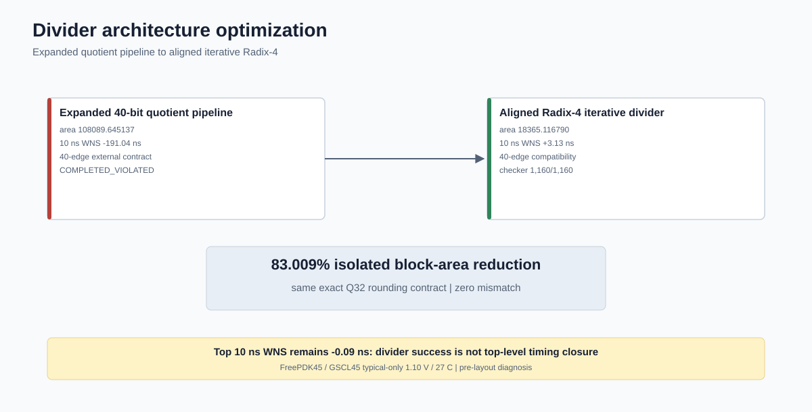
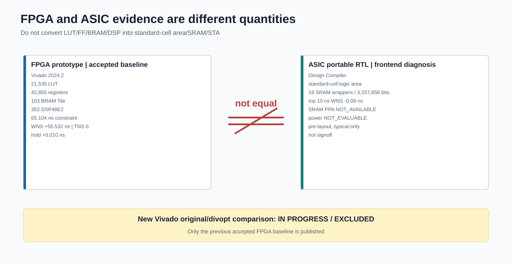

<div align="center">

# RLS Self-Interference Cancellation Soft IP

**12-tap complex RLS digital self-interference canceller for full-duplex wideband transceiver research**

[](reports/modelsim/preserved_summary.md)
[](reports/modelsim/convergence_metrics.csv)
[](reports/asic/divider_optimization.csv)
[](reports/asic/dc_logic_summary.md)

[中文](README.md) | [English](README.en.md) | [Specification](docs/rls_asic_spec.md) | [Evidence index](reports/showcase/evidence_index.md)

</div>



## 60-second view

| Area | Verified result | Boundary |
| --- | --- | --- |
| Datapath | 12-tap complex RLS, `P0=8I`, single-reference alias mode | `RTL_OBSERVED_A0` |
| Schedule | 150-cycle core, 175-cycle steady update, one 208-cycle refill | Current RTL/vector |
| FPGA prototype | Accepted baseline: 21,535 LUT, 42,855 registers, 103 BRAM Tile, 352 DSP48E2 | Not convertible to ASIC area |
| ASIC-portable RTL | XCI-free build and 18 SRAM-wrapper integration boundary | Macro payload and full PPA excluded |
| Divider | Aligned Radix-4, 1,160/1,160, -83.009% block area, +3.13 ns WNS at 10 ns | Isolated pre-layout diagnostic |
| Convergence | 1,000 updates; 43.166/43.249 dB residual-power reduction | `IMPLEMENTATION_RESIDUAL_CONVERGENCE_OBSERVED` |
| ASIC top | -0.09 ns WNS at 10 ns; -5.586154% standard-cell logic area | Timing is **not met** |
| Publish status | Showcase complete; new Vivado comparison excluded while in progress | `IN PROGRESS / EXCLUDED` |

## Integration entry point

Use [`RLS12_c_MW_top_divopt`](rtl/optimized/top/RLS12_c_MW_top_divopt.v). The interface retains `clk/rst_n/BUF_len/sel_* /in_var_p`, residual and serialized-weight outputs, and exposes `reset_ready`. The accepted mode requires `sel_fb1 == sel_fb2`; independent dual-reference operation is not verified.

Inputs are upper-real/lower-imaginary signed 24Q13. P is 36Q29, W is 36Q27, Y/E is 36Q25, the denominator is 34Q25, gain/reciprocal is 24Q20, and the P-update accumulator is 40 bits per component. See [architecture](docs/en/architecture.md) and [fixed point](docs/en/fixed_point.md).

## Verification and convergence



The preserved run used ModelSim SE-64 10.6d with top `test_rls_convergence` and DUT `RLS12_c_MW_top_divopt`. It completed 1,000 updates and 12,000 weights with schedule `175:998;208:1`, zero valid X/Z, and about 11.410517665 ms observed time. Original implementation versus divopt comparison covered 174,918 residual samples and 12,000 weights with zero mismatch.



| Channel | Early RMS | Late RMS | Power reduction | Stable marker |
| --- | ---: | ---: | ---: | ---: |
| `dout_sub_data1` | 2784.158 | 19.338 | 43.166 dB | update 684 |
| `dout_sub_data2` | 2778.053 | 19.112 | 43.249 dB | update 689 |

This is implementation residual behavior, not an independent claim of authoritative system-algorithm correctness.

## ASIC and FPGA evidence



The aligned Radix-4 divider reduced isolated standard-cell logic area from 108089.645137 to 18365.116790 (-83.009%) and changed 10 ns WNS from -191.04 ns to +3.13 ns. At top level, logic area fell 5.586154%, but 10 ns WNS remained -0.09 ns. Phase 4 is therefore `PHASE4_OPTIMIZATION_PARTIAL_WITH_EXPLICIT_BLOCKERS`, not timing PASS.

There are 18 SRAM wrappers and 3,257,856 unbound bits. SRAM area/power, SRAM-crossing timing, and full-IP PPA are `NOT_AVAILABLE`. SAIF sequential mapping reached 54.64% with PWR-415, so power and energy/update are `NOT_EVALUABLE`.



The accepted Vivado 2024.2 baseline for `RLS12_c_MW_top` used a 65.104 ns clock constraint and reported +55.532 ns setup WNS, zero TNS, and +0.010 ns hold slack. No formal Fmax sweep was performed; the reciprocal of a 9.460 ns data path is not reported as Fmax. FPGA LUT/FF/BRAM/DSP and ASIC standard-cell/SRAM/STA quantities are not directly convertible.

## Reproduce

```powershell
.\scripts\simulation\Launch-ConvergenceSimulation.ps1
.\scripts\simulation\Invoke-DividerCheck.ps1
python .\scripts\documentation\gen_readme_assets.py
python .\scripts\documentation\check_showcase_docs.py
```

Commercial tools, licenses, PDKs, and memory libraries must be supplied legally by the user. See [reproduction](docs/en/reproduction.md), [limitations](docs/en/limitations.md), and [`PUBLIC_SCOPE.md`](PUBLIC_SCOPE.md).

This repository does not claim tapeout readiness, silicon proof, full RTL-to-GDS, complete PPA, 100 MHz achievement, power optimization, Formality/GLS/CI PASS, or an authoritative algorithm-golden pass.
