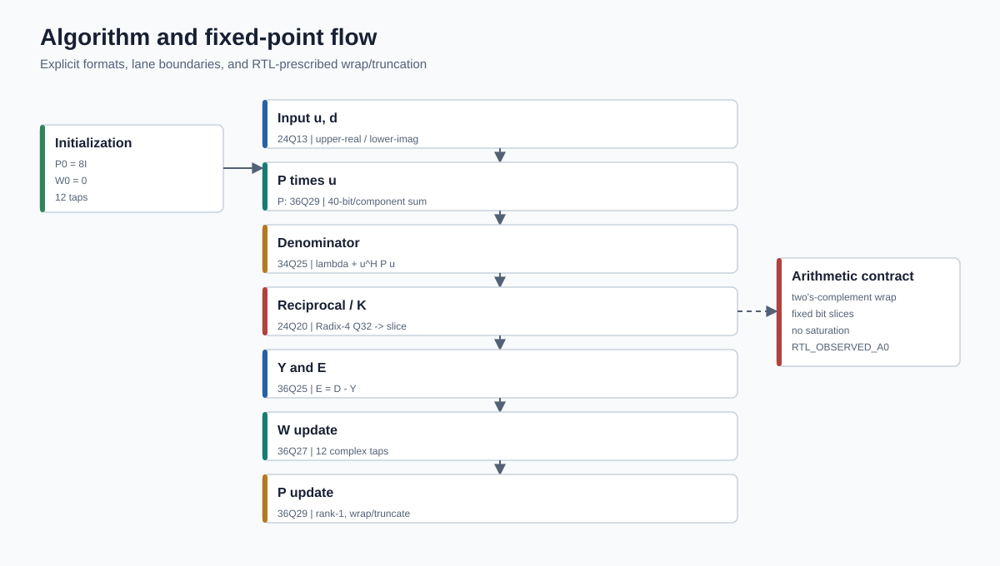

<div align="center">

# RLS Self-Interference Cancellation Soft IP

**面向全双工宽带收发芯片的 12 阶复数 RLS 数字自干扰对消 Soft IP**

[](reports/modelsim/preserved_summary.md)
[](reports/modelsim/convergence_metrics.csv)
[](reports/asic/divider_optimization.csv)
[](reports/asic/dc_logic_summary.md)

[中文](README.md) | [English](README.en.md) | [规格书](docs/rls_asic_spec.md) | [证据索引](reports/showcase/evidence_index.md)

</div>


## 60 秒总览

| 项目 | 已验证结论 | 边界 |
| --- | --- | --- |
| 算法/数据通路 | 12 阶复数 RLS，`P0=8I`，single-reference alias mode | `RTL_OBSERVED_A0` |
| 调度 | 150-cycle 核心；稳态更新 175 cycles；一次 208-cycle refill | 当前 RTL/向量 |
| FPGA 原型 | 旧正式 Vivado 基线：21,535 LUT、42,855 registers、103 BRAM Tile、352 DSP48E2 | 不是 ASIC 面积换算 |
| ASIC portable RTL | 无 XCI 的可编译 RTL 与 18 个 SRAM wrapper 边界 | 宏库和完整 PPA 不在仓库中 |
| Divider 优化 | aligned Radix-4，1,160/1,160；块面积 -83.009%；10 ns WNS +3.13 ns | 隔离 divider、pre-layout 诊断 |
| 长时间仿真 | 1,000 updates；两路残差功率下降 43.166/43.249 dB | `IMPLEMENTATION_RESIDUAL_CONVERGENCE_OBSERVED` |
| ASIC 顶层 | 10 ns WNS -0.09 ns；标准单元逻辑面积 -5.586154% | timing **未通过**；SRAM/PPA 不完整 |
| 发布状态 | Showcase 完成；新 Vivado comparison 未提交且被排除 | `IN PROGRESS / EXCLUDED` |

## 集成入口

推荐顶层是 [`RLS12_c_MW_top_divopt`](rtl/optimized/top/RLS12_c_MW_top_divopt.v)。它保留原始周期行为，并新增可见的同步复位完成信号 `reset_ready`。

| 端口 | 宽度 | 说明 |
| --- | ---: | --- |
| `clk`, `rst_n` | 1 | 单时钟；外部低有效异步复位，内部同步释放 |
| `BUF_len` | 14 | 输入缓冲长度；公开验证使用 1000 |
| `sel_en` | 1 | 输入有效 |
| `sel_rx` | 48 | desired/received complex sample，upper-real/lower-imag，24Q13/分量 |
| `sel_fb1`, `sel_fb2` | 48 | 自适应参考；当前模式要求两者相同 |
| `in_var_p` | 36 | P 初始化参数，36Q29；公开验证值对应 `P0=8I` |
| `RLS_out*`, `coef_update_*`, `update_cnt` | mixed | 残差、12 个串行权值和状态 |
| `reset_ready` | 1 | 核心可以接受/监视数据的显式边界 |

当前实现是 single-reference alias mode：集成方必须维持 `sel_fb1 == sel_fb2`。两端口并不构成已验证的独立双参考算法。

## 架构与定点方法



| 数据 | 格式 | 处理规则 |
| --- | --- | --- |
| 输入 | 24Q13 / complex component | 外部 upper-real/lower-imag |
| P | 36Q29 | 初值 `8I` |
| W | 36Q27 | 12 个复数权值，串行输出 |
| Y / E | 36Q25 | `E = D - Y` |
| denominator | 34Q25 | 加入量化遗忘因子 |
| K / reciprocal | 24Q20 | aligned Radix-4 divider 输出路径 |
| P update accumulator | 40 bit / component | 保留 RTL slice、wrap 与 truncation 行为 |

详细推导见[架构](docs/zh-CN/architecture.md)和[定点格式](docs/zh-CN/fixed_point.md)。这里不把 implementation oracle 宣称为独立、权威的系统算法 golden model。

## 验证流程


正式保存证据来自可信源提交 `44f433808e4c7884c3ba488c5b20d764500bd5fa`。仓库同时提供 fresh runner；两者必须明确区分：

- **Preserved evidence**：原 Xilinx hierarchy 与 portable/divopt RTL 的 174,918 residual、12,000 weights、schedule 均为零 mismatch。
- **Fresh reproduction**：公开 portable/divopt RTL 重新跑满 1,000 updates，并与保存指标交叉检查。
- **Claim boundary**：收敛只证明当前实现/输入下残差行为；不扩大为 RF 系统性能或独立算法正确性。

## 收敛结果


ModelSim SE-64 10.6d，top `test_rls_convergence`，DUT `RLS12_c_MW_top_divopt`：

| 通道 | early RMS | late RMS | 功率下降 | 稳定标记 |
| --- | ---: | ---: | ---: | ---: |
| `dout_sub_data1` | 2784.158 | 19.338 | 43.166 dB | update 684 |
| `dout_sub_data2` | 2778.053 | 19.112 | 43.249 dB | update 689 |

仿真覆盖 1,000 updates、12,000 weights，`175:998;208:1`，valid X/Z 为 0；观察时长约 11.410517665 ms。机器可读数据见 [`convergence_metrics.csv`](reports/modelsim/convergence_metrics.csv) 和由逐样本证据生成的 [`convergence_curve.csv`](reports/modelsim/convergence_curve.csv)。

## ASIC 结果


| 指标 | baseline | aligned Radix-4 | 结论 |
| --- | ---: | ---: | --- |
| Divider checker | 1,160/1,160 | 1,160/1,160 | zero mismatch；40-edge compatibility |
| Divider logic area | 108089.645137 | 18365.116790 | -83.009% |
| Divider 10 ns WNS | -191.04 ns | +3.13 ns | 隔离块满足该诊断约束 |
| Top logic area | 2403588.477132 | 2269320.333519 | -5.586154% |
| Top 10 ns WNS | -188.19 ns | -0.09 ns | **仍违反 timing** |

Phase 4 状态是 `PHASE4_OPTIMIZATION_PARTIAL_WITH_EXPLICIT_BLOCKERS`。所有 ASIC 数字都只代表 FreePDK45/GSCL45 typical-only 1.10 V/27 C 的 pre-layout 标准单元逻辑诊断。18 个 SRAM wrapper 共 3,257,856 bits；SRAM area/power、跨 SRAM STA、完整 IP PPA 均为 `NOT_AVAILABLE`。SAIF 顺序单元映射 54.64% 且存在 PWR-415，因此 power 和 energy/update 为 `NOT_EVALUABLE`。

## FPGA 结果


旧正式 Vivado 2024.2 routed baseline 的顶层是 `RLS12_c_MW_top`，65.104 ns 约束下 WNS +55.532 ns、TNS 0、hold +0.010 ns。未执行正式 Fmax sweep，9.460 ns routed data path 的倒数不得写成 Fmax。新的 comparison 仍在受保护源工作区运行，未提交数据没有纳入本仓库。

## 快速复现

```powershell
# ModelSim: batch 1,000-update portable/divopt convergence
.\scripts\simulation\Launch-ConvergenceSimulation.ps1

# ModelSim: 1,160-vector divider contract
.\scripts\simulation\Invoke-DividerCheck.ps1

# Deterministic public figures and documentation checks
python .\scripts\documentation\gen_readme_assets.py
python .\scripts\documentation\check_showcase_docs.py
```

ModelSim、Vivado、Design Compiler、许可证、PDK 和宏库由使用者在本地合法提供；仓库不含这些 payload。工具不在 `PATH` 时可传 runner 参数或设置 `RLS_MODELSIM` / `RLS_PYTHON`。详细步骤见[复现说明](docs/zh-CN/reproduction.md)。

## 目录

```text
rtl/             compat reference + portable RTL + optimized RTL + filelists
tb/              convergence and divider testbenches
verification/    vectors, implementation oracle and checkers
constraints/     public ASIC/FPGA constraints
scripts/         simulation, frontend, Vivado boundary and documentation
reports/         sanitized preserved evidence and machine-readable results
docs/            bilingual guides, SVGs and synchronized MD/DOCX/PDF spec
```

## 限制

本项目不宣称 tapeout-ready、silicon-proven、完整 RTL-to-GDS、完整 PPA、100 MHz achieved、power optimized、Formality/GLS/CI PASS 或 authoritative algorithm golden pass。尚未完成布局布线、签核、SRAM 宏绑定、完整活动功耗验证与新 Vivado comparison。详见[限制清单](docs/zh-CN/limitations.md)和 [`PUBLIC_SCOPE.md`](PUBLIC_SCOPE.md)。
